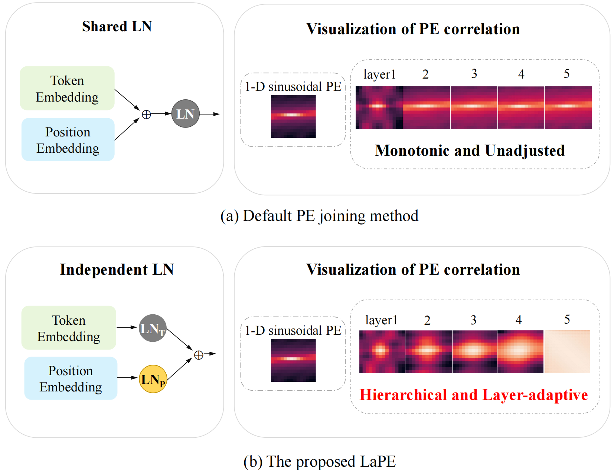

<div align="center">
# 【ICCV'2023 🔥】LaPE: Layer-adaptive Position Embedding for Vision Transformers with Independent Layer Normalization
[](https://openaccess.thecvf.com/content/ICCV2023/papers/Yu_LaPE_Layer-adaptive_Position_Embedding_for_Vision_Transformers_with_Independent_Layer_ICCV_2023_paper.pdf)
</div>

## 📕 Overview
Position information is critical for Vision Transformers (VTs) due to the permutation-invariance of self-attention operations. A typical way to introduce position information is adding the absolute Position Embedding (PE) to patch embedding before entering VTs. 

However, this approach operates the same Layer Normalization (LN) to token embedding and PE, and delivers the same PE to each layer. This results in restricted and monotonic PE across layers, as the shared LN affine parameters are not dedicated to PE, and the PE cannot be adjusted on a per-layer basis.

To overcome these limitations, we propose using two independent LNs for token embeddings and PE in each layer, and progressively delivering PE across layers. By implementing this approach, VTs will receive layer-adaptive and hierarchical PE. We name our method as **L**ayer-**a**daptive **P**osition **E**mbedding, abbreviated as LaPE, which is simple, effective, and robust. 

<div align="center">

</div>

Here we use the codebase of [DeiT](https://github.com/facebookresearch/deit) to illustrate how to realize LaPE.

## 🚀 Quick Start
### Data preparation
Download and extract ImageNet train and val images from http://image-net.org/. The directory structure is the standard layout for the torchvision datasets.ImageFolder, and the training and validation data is expected to be in the train/ folder and val folder respectively:
```
/path/to/ImageNet/
  train/
    class1/
      img1.jpeg
    class2/
      img2.jpeg
  val/
    class1/
      img3.jpeg
    class2/
      img4.jpeg
```
### Setup Environmet
```
conda create -n LaPE python=3.7
conda activate LaPE
pip install -r requirements.txt
```
or you can use the following docker image
```
sudo docker run -it --gpus all  --rm -v /local/directory:/container/directory vrunyiyu/deit_lape:new bash
```

### Training
```
python -m torch.distributed.launch --nproc_per_node=[num_gpus] --master_port [port] \
    --use_env main.py --model [model type] --batch-size [bs] \
    --data-path [path to dataset] --output_dir [path to output] --join-type [PE joining method] 
```
for example
```
python -m torch.distributed.launch --nproc_per_node=4 --master_port 29400 \
    --use_env main.py --model deit_tiny_patch16_224 --batch-size 256 \
    --data-path data/imagenet --output_dir result/deit_t_LaPE/ --join-type LaPE
```
### Evaluatation
```
python main.py --eval --resume [path to model] \
    --model [model name] --data-path [path to dataset] --join-type [PE joining method] 
```
for example
```
python main.py --eval --resume result/deit_t_LaPE/best_checkpoint.pth \
    --model deit_tiny_patch16_224 --data-path data/imagenet --join-type LaPE
```

### Visualizing the position correlation
```
python similarity_visualize.py --ckpt_path [checkpoint path] \
    --save_dir [path to save the visualization images] --model_name [model name] \
    --pe [pe type] --join-type [PE joining method] 
```
for example
```
python similarity_visualize.py --ckpt_path result/deit_t_LaPE/best_checkpoint.pth \
    --save_dir visualize/similarity --model_name deit_t_LaPE \
    --pe learnable --join-type LaPE
```

## 📌 Citation
If you find this paper useful, please consider staring 🌟 this repo and citing 📑 our paper:
```
@inproceedings{yu2023lape,
  title={LaPE: Layer-adaptive Position Embedding for Vision Transformers with Independent Layer Normalization},
  author={Yu, Runyi and Wang, Zhennan and Wang, Yinhuai and Li, Kehan and Liu, Chang and Duan, Haoyi and Ji, Xiangyang and Chen, Jie},
  booktitle={Proceedings of the IEEE/CVF International Conference on Computer Vision},
  pages={5886--5896},
  year={2023}
}
```